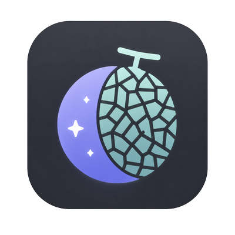
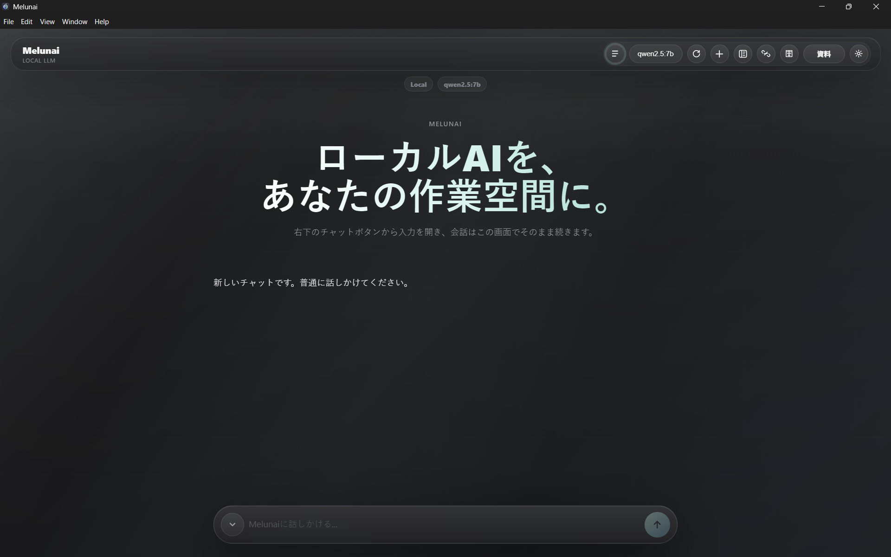
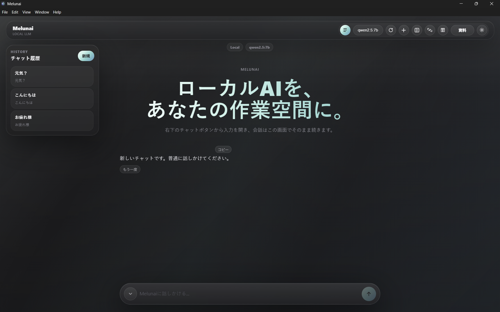
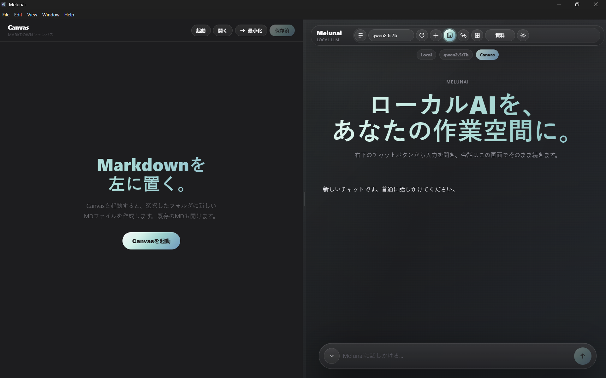

# Melunai

Melunai is an experimental local-first AI workspace for the coming era of smaller, more capable open-weight models.

It is not a finished product. It is not trying to pretend that today's small local LLMs are already as strong as frontier cloud models. Melunai is an early alpha prototype built around a simple question:

> What should an AI workspace look like if useful language models eventually run on ordinary personal computers?

## Why Melunai Exists

Many technologies begin as large, expensive, awkward tools and gradually become smaller, cheaper, more efficient, and more personal.

Early personal computers could take up most of a desk. Early mobile phones were heavy, limited, and far from the pocket-sized devices people use today. Cameras, storage devices, music players, and GPS navigation also moved from separate specialized hardware into everyday personal devices. Over time, useful technology often moves closer to the individual user.

Melunai starts from the belief that AI may follow the same path.

Today, the most capable frontier AI systems still depend on huge data centers, large GPU clusters, and expensive cloud inference. But open-weight models are moving fast. Model families such as DeepSeek, Qwen, Kimi, and others suggest a possible future where increasingly capable AI can run closer to the user, and eventually on ordinary personal computers.

If that future arrives, the important question will not only be "which model is best?" It will also be:

- How should local AI interact with your files?
- How should weak or medium local models be guided so they fail less?
- How should privacy-first AI feel on a normal desktop?
- What kind of UI makes local AI approachable for non-engineers?

Melunai is an experiment in that direction.

It may be wrong. If useful AI remains fundamentally dependent on large cloud infrastructure, Melunai's core assumption may fail. But if capable local models continue to improve, Melunai is an attempt to prepare for that future early.

## Alpha Reality Check

This repository is `v0.1.0-alpha`.

That means:

- This is an early public prototype.
- Many parts are rough.
- Some features are experimental.
- Small local models can misunderstand instructions.
- Corpus/document reference quality is not yet reliable.
- This is not a replacement for ChatGPT, Claude, Codex, or other frontier systems.

Melunai currently works best as a local LLM chat and Markdown workspace. Its longer-term goal is more ambitious: a local-first AI workspace that becomes more useful as local models improve.

## Screenshots

### App Icon



### Main Chat Workspace



### Chat History



### Markdown Canvas



## What Melunai Can Do Today

- Chat with a local Ollama model
- Save and reopen local chat history
- Edit Markdown in a Canvas-style workspace
- Generate Markdown drafts with the local model
- Build and reference a local document index inspired by Corpus2Skill-style workflows
- Experiment with local MCP server connections

## What Is Still Experimental

- Corpus / document reference quality
- Weak-model behavior with small models such as `qwen2.5:7b`
- MCP integrations
- Installer signing
- Auto-update
- Non-technical onboarding
- Production-grade packaging

## Requirements

For normal local LLM use:

- Windows 10/11
- Ollama
- A local model, for example `qwen2.5:7b`

For development:

- Node.js 20+
- npm

Install a local model:

```bash
ollama pull qwen2.5:7b
```

Make sure Ollama is running before using Melunai.

## Run From Source

```bash
npm install
npm run electron:dev
```

## Test

```bash
npm run test:unit
```

## Build

Build the renderer and Electron main process:

```bash
npm run build
npm run electron:build
```

Create a Windows installer:

```bash
npm run electron:dist
```

The installer is generated in:

```text
dist-package/
```

## Distribution Notes

The Windows installer includes Melunai and Electron, but it does not include:

- Ollama
- LLM model files
- Node.js development tools

For now, updates are manual. Download and install the latest release from GitHub Releases.

Windows builds are currently unsigned, so Windows SmartScreen may show a warning.

## Privacy And Local Data

Melunai is designed around local-first operation.

Stored locally:

- Chat history
- Canvas Markdown files
- Corpus indexes
- Local app settings

When using Ollama, prompts and selected context are sent to the configured local Ollama server, usually:

```text
http://localhost:11434
```

When using MCP servers, data handling depends on the server you configure. Only connect MCP servers you trust.

## Security

Melunai handles local files, local model prompts, and optional MCP servers. Treat it as experimental software.

Please report security issues using the guidance in [SECURITY.md](./SECURITY.md).

## Project Direction

Melunai is built around three ideas:

1. Local-first AI should be treated as a real product direction, not only a toy.
2. Weak local models need better surrounding systems, not just bigger prompts.
3. AI software should be beautiful enough that non-engineers want to use it.

The current version is small. The bet is long-term.

## How This Project Was Built

Melunai is also an experiment in AI-assisted software creation.

The project owner is driving the product concept, direction, taste, and requirements. The implementation has been built through Claude Code and Codex. The owner is intentionally minimizing hand-written application code and relying on AI coding agents for implementation.

That is part of the experiment:

- Can AI coding agents build and maintain an AI application with enough human direction?
- Where does AI-assisted development work well?
- Where does it become fragile, unsafe, or low-quality?
- How much product quality can come from a human idea, taste, and review loop combined with AI implementation?

Many engineers are skeptical of heavily AI-assisted or "vibe coded" software. That skepticism is reasonable. Melunai does not try to hide how it was made. Instead, it treats that process as another research question.

Melunai is a local AI product, and also a test of whether AI agents can help build the tools that come after them.

## License

MIT
